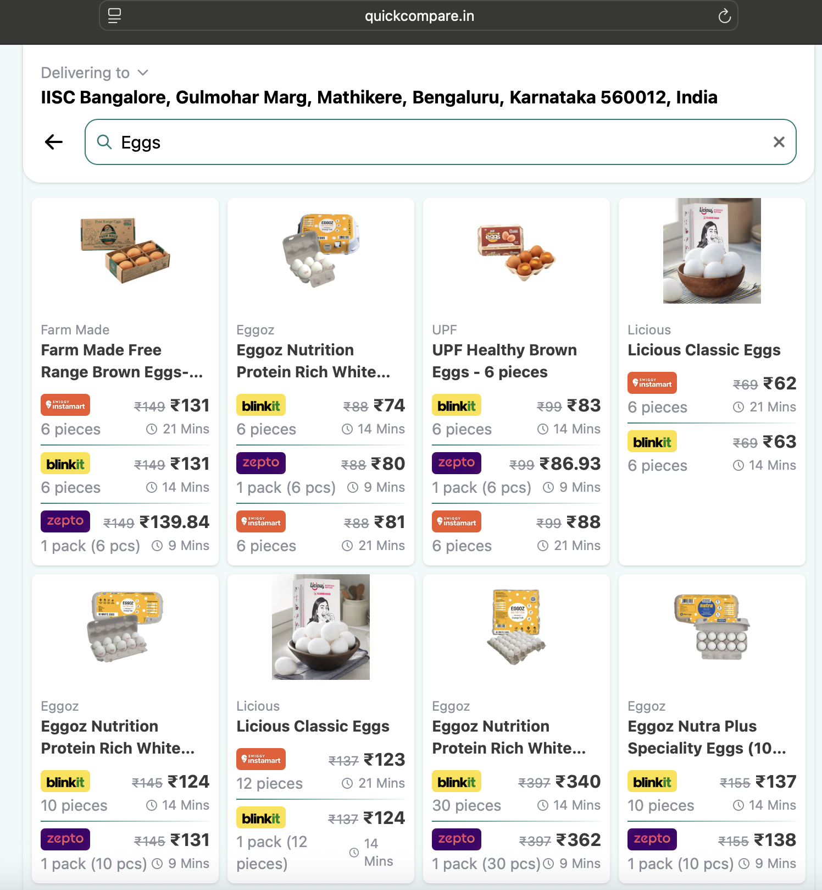
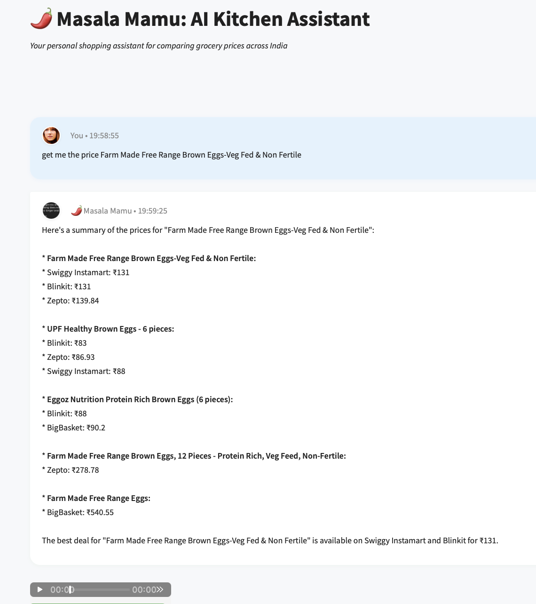

# Price Comparison Agent

A Python-based intelligent agent that helps users find and compare product prices across multiple online platforms in India. The agent uses web scraping to gather real-time price data from popular e-commerce and grocery delivery platforms.

## Features

- **Multi-platform Price Comparison**: Compare prices across Blinkit, Zepto, Swiggy Instamart
- **Intelligent Search**: Natural language product search with AI-powered query processing
- **Real-time Data**: Live price scraping from QuickCompare.in
- **Best Deal Identification**: Automatically highlights cheapest and most expensive options
- **Comprehensive Analysis**: Provides insights about price differences and platform availability

## Architecture

The system consists of three main components:

1. **QuickCompare Scraper** (`quickcompare_tool.py`): Web scraping tool using Playwright
2. **Agent Logic** (`price_compare_agent.py`): LangChain-based agent with tool calling capabilities
3. **System Prompts** (`price_compare_agent_prompt.py`): AI agent instructions and behavior

## Installation

### Prerequisites

- Python 3.8 or higher
- Google API key for Gemini model access

### Dependencies

```bash
pip install langchain-google-genai
pip install langchain-core
pip install langchain
pip install playwright
pip install asyncio
pip install dataclasses
pip install logging
```

### Playwright Setup

After installing Playwright, you need to install the browser binaries:

```bash
playwright install
```

## Configuration

### Environment Setup

Set your Google API key as an environment variable:

```bash
export GOOGLE_API_KEY="your-google-api-key-here"
```

## Example Output

### QuickCompare Web Interface
The agent scrapes price data from QuickCompare.in, which aggregates prices from multiple platforms:




### AI Agent Response
The Masala Mamu AI Assistant processes user queries and provides comprehensive price comparisons:




### Sample Console Output

```
QuickCompare Results for 'eggs' (showing top 3 results):

Brand: Farm Made
Product: Farm Made Free Range Brown Eggs-Veg Fed & Non Fertile
Offers:
  - Swiggy Instamart: ₹131 (6 pieces)
  - Blinkit: ₹131 (6 pieces)  
  - Zepto: ₹139.84 (1 pack - 6 pcs)
---

Brand: UPF
Product: UPF Healthy Brown Eggs - 6 pieces
Offers:
  - Blinkit: ₹83 (6 pieces)
  - Zepto: ₹86.93 (1 pack - 6 pcs)
  - Swiggy Instamart: ₹88 (6 pieces)
---

Brand: Eggoz
Product: Eggoz Nutrition Protein Rich White Eggs
Offers:
  - Blinkit: ₹74 (6 pieces)
  - Zepto: ₹80 (1 pack - 6 pcs)
  - BigBasket: ₹90.2 (6 pieces)
---

Best Deal Summary:
✅ Cheapest: Farm Made Free Range Brown Eggs at ₹131 (Swiggy Instamart & Blinkit)
💰 Most Expensive: Farm Made Free Range Brown Eggs at ₹139.84 (Zepto)
📊 Price Range: ₹74 - ₹139.84
🛒 Platforms Available: 4 (Blinkit, Zepto, Swiggy Instamart, BigBasket)
```

## License

This project is provided as-is for educational and personal use. Please respect the terms of service of the scraped websites.

## Disclaimer

This tool is for educational and personal use only. Users are responsible for complying with the terms of service of the websites being scraped. The authors are not responsible for any misuse of this tool.